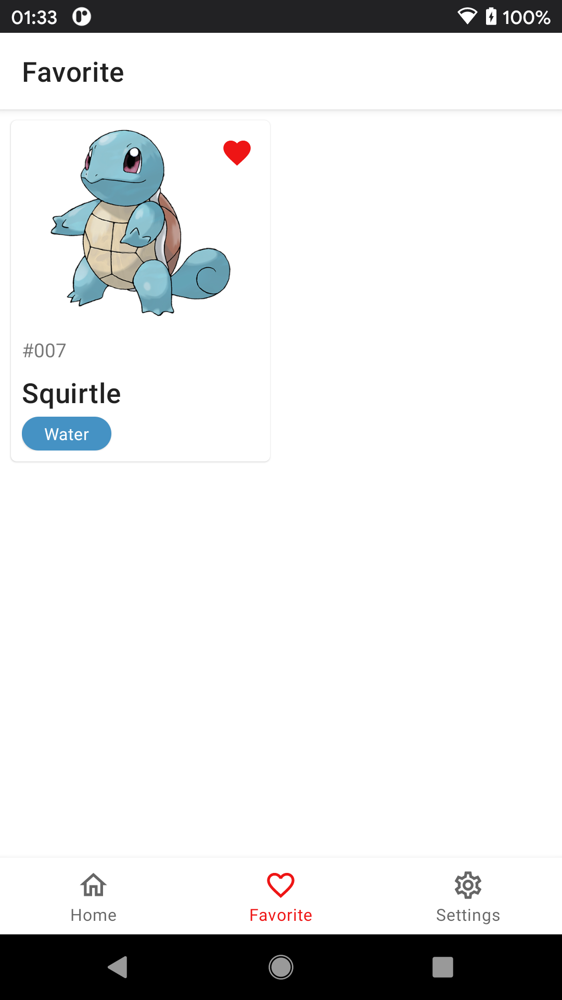

# Pokemon App

<div align="center">
    
</div>

## About

This app shows shows all Pokemon list page with pagination from [PokeApi.co](https://pokeapi.co).

## APK

APKs can be downloaded in the [release page](https://github.com/hanmajid/pokemon-app/releases).

## Features

- User can browse pokemon in a list
- User can view detail information of each monster
- User can view the image of each monster
- User can collect a favorite monster
- User can view list of favorite monster
- User can delete a favorite monster from list
- Using Kotlin with min SDK 21.
- Using Data Binding
- Using MVVM design pattern
- Using Dependency Injection implementation (Koin)
- Using GraphQL
- Using Firebase Crashlytics

## Architecture

From top-to-bottom:

- UI layer: Activity & Fragments
- ViewModel layer
- Repository layer
- UseCase layer
- Data layer
  - GraphQL service
  - Room Database

## GraphQL

All files related to GraphQL are located in
folder: `app/src/main/graphql/com/hanmajid/android/pokemonapp/`.

To download PokeApi's GraphQL schema, run this command:

```
./gradlew _pokemonDownloadSchema
```

## Screenshots

| | |
| - | - |
| Pokemon List Screen | Pokemon Detail Screen |
|  |  |
| Favorite Pokemon Screen | Settings Screen |
|  |  |

## Others

App Launcher: https://icon-icons.com/download/67563/SVG/512/